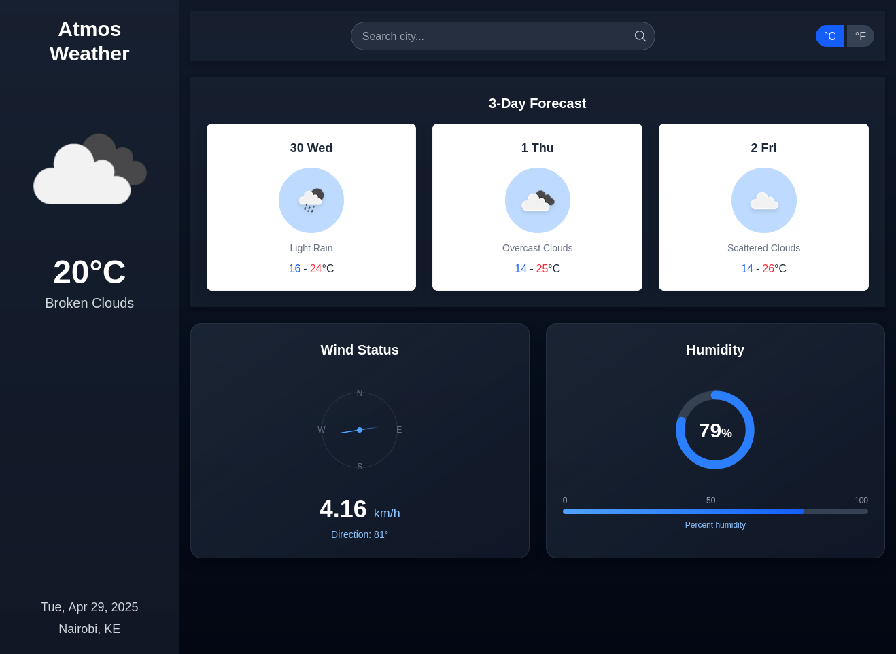
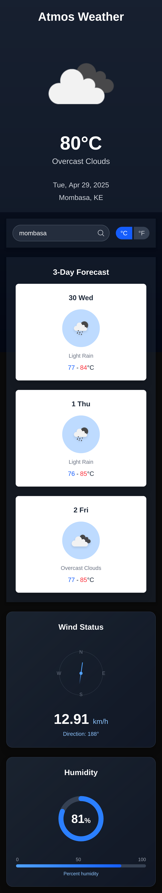
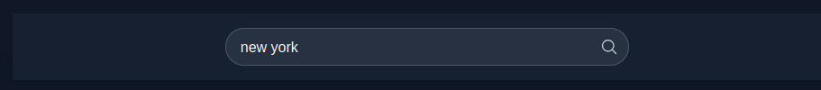
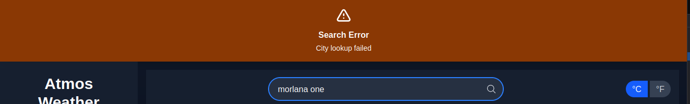

# Atmos

A Dockerized decoupled weather application with a NextJS frontend and Laravel API backend. This application fetches weather data from OpenWeatherMap API.

## Table of Contents

- [Project Structure](#project-structure)
- [Setup and Deployment Instructions](#setup-and-deployment-instructions)
- [API Endpoints](#api-endpoints)
- [User Interface](#user-interface)
- [Docker Deployment](#docker-deployment)
- [Features and Technologies](#features-and-technologies)
- [Development](#development)
- [License](#license)

## Project Structure

```
.
├── api/                    # Laravel backend API
├── docker/                 # Docker configurations
│   ├── Dockerfile.api      # API Dockerfile
│   ├── Dockerfile.webapp   # Web App Dockerfile
│   ├── docker-compose.yml  # Docker Compose
│   ├── screenshots         # UI screenshots
│   ├── scripts/            # Utility scripts 
│   │   ├── run-docker.sh   # Convenience script for Docker commands
├── webapp/                 # NextJS frontend application
└── README.md               # Project Documentation
```

## Setup and Deployment Instructions

### Prerequisites

- Docker and Docker Compose
- OpenWeatherMap API key (get one from [OpenWeatherMap](https://openweathermap.org/api), The free tier is sufficient for this application)

### Environment Configuration

1. Create a `.env` file in the `docker/` and `api/` directory with the following content:

```
APP_KEY="base64:DKO+AE1ALdJvq5MoQRXBf9HpbIGb5qWAP0qvW5kk160="
OPENWEATHER_API_KEY="your_openweathermap_api_key_here"
```

2. Replace `your_openweathermap_api_key_here` with your actual OpenWeatherMap API key.

### Running the Application

#### Using the Convenience Script

A convenience script is provided to simplify Docker commands:

```bash
# Make the script executable (first time only)
chmod +x scripts/run-docker.sh

# Start the containers
./scripts/run-docker.sh up -d

# Stop the containers
./scripts/run-docker.sh down

# View container logs
./scripts/run-docker.sh logs

# Restart containers
./scripts/run-docker.sh restart
```

#### Using Manual Docker Commands

Alternatively, you can use the full Docker Compose commands:

```bash
docker compose -f docker/docker-compose.yml --env-file docker/.env up -d
```

## API Endpoints

- `GET /api/health` - Health check endpoint
- `GET /api/weather?city={city}` - Get weather data for a specific city
  - Optional query parameter: `units` (metric, imperial) - Default: metric

## User Interface

The Atmos Weather App provides a clean, intuitive interface for checking weather conditions and forecasts.

### Main Features

- **Search Functionality**: Enter a city name in the search bar and press Enter to get weather data
- **Unit Toggle**: Switch between Celsius (°C) and Fahrenheit (°F) using the toggle button
- **Current Weather Display**: View current temperature, weather conditions, and date
- **3-Day Forecast**: See the weather forecast for the next three days
- **Detailed Metrics**: Check wind speed, direction, and humidity levels

### Screenshots

#### Desktop View


*The desktop view shows a two-column layout with current weather on the left and detailed information on the right.*

#### Mobile View


*On mobile devices, the layout adjusts to a single column for better usability.*

#### Weather Search


*Simply type a city name and press Enter to get weather information.*

#### Error Handling


*When a city isn't found, a toast notification appears while maintaining the current weather display.*

## Architecture

The Atmos Weather App is fully containerized with Docker, making it easy to deploy and run in any environment.

### Container Architecture

- **Laravel API**: Backend service that communicates with OpenWeatherMap API
- **Nginx Webserver**: Serves the Laravel API on port 8080
- **Next.js Webapp**: Frontend application served on port 3000

## Features and Technologies

### Key Features

- **Responsive Design**: Works seamlessly on mobile, tablet, and desktop devices
- **Real-time Weather Data**: Fetches current conditions from OpenWeatherMap API
- **3-Day Forecast**: Shows weather predictions for the next three days
- **Unit Switching**: Toggle between Celsius and Fahrenheit
- **Error Handling**: Graceful error management with toast notifications
- **Loading States**: Improved UX with loading indicators that don't hide content
- **Docker Integration**: Fully containerized application for easy deployment

### Technology Stack

#### Backend
- **Laravel version 12.x**: PHP framework for the API
- **OpenWeatherMap API**: External weather data provider
- **Docker version 28.1.1**: Containerization for deployment

#### Frontend
- **Node version 22.13.1**: JavaScript runtime for the frontend
- **Next.js**: React framework with TypeScript
- **Tailwind CSS**: Utility-first CSS framework
- **RippleUI**: Component library for Tailwind

## Development

### Backend (Laravel)

The Laravel backend uses the OpenWeatherMap API to fetch weather data. The main components are:

- `WeatherController` - Handles the API requests and responses
- Environment variables for API keys and configuration

### Frontend (NextJS)

The frontend is a NextJS application that consumes the Laravel API. It uses RippleUI components from Tailwind CSS for the UI.

- **Components**:
  - `WeatherClient`: Main component that handles API calls and state management
  - `SearchBar`: Handles city search functionality
  - `UnitToggle`: Toggles between metric and imperial units
  - `ForecastCard`: Displays forecast information for a single day
